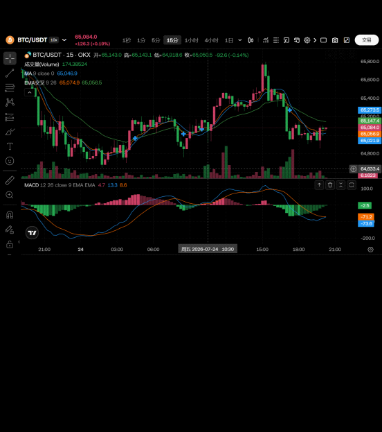
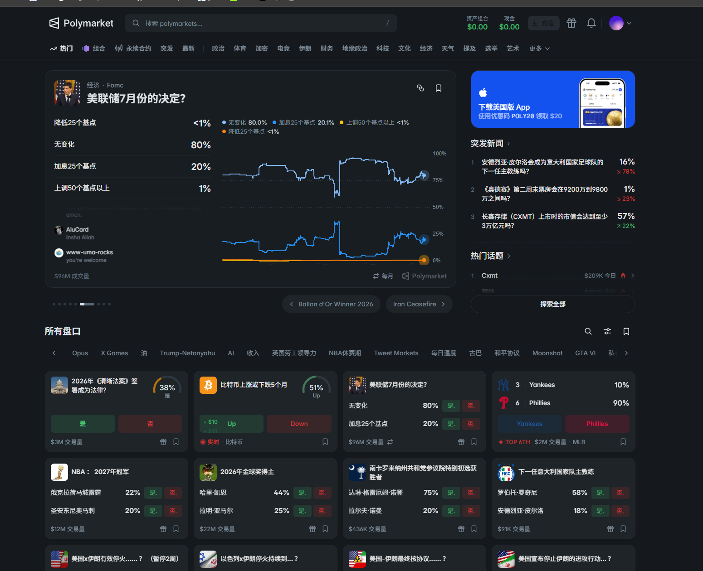

# 福纹排行榜系统 - 第一版需求文档

---

## 一、多智能体预测交易功能

### 1.1 核心功能描述

使用三个或以上的 AI 大模型或智能体对 BTC 进行预测和交易。

### 1.2 预测交易策略

**决策逻辑：**
- **一致信号**：当出现两个智能体的涨跌判断方向一致时，直接对接 Polymarket 进行下单
- **分歧处理**：当两个智能体的预测结果出现一个涨一个跌的情况，以第三个智能体的预测信号为准进行下单
- **订单大小**：常规情况订单大小为 **5 美元**
- **加倍机制**：当三个智能体全部预测同一方向时，订单金额**加倍**（10 美元）

---

## 二、预测结果可视化与排行榜

### 2.1 核心功能描述

将预测交易的结果进行可视化展示，并对不同的交易账号和智能体进行排名。

### 2.2 排名维度

| 周期 | 说明 |
| :--- | :--- |
| 日榜 | 每日交易胜率和收益率排名 |
| 周榜 | 每周交易胜率和收益率排名 |
| 月榜 | 每月交易胜率和收益率排名 |
| 季度榜 | 每季度交易胜率和收益率排名 |
| 年榜 | 年度交易胜率和收益率排名 |

### 2.3 排名指标

- **胜率**：盈利交易笔数占总交易笔数的比例
- **收益率**：账户收益金额占初始资金的比例

---

## 三、跟单交易与智能体租用

### 3.1 核心功能描述

针对功能二的排行榜，让其他注册用户可以：

1. **跟单交易**：支付费用给排行榜高胜算的交易员进行跟单交易
2. **智能体租用**：分时租用智能体进行预测交易
3. **无脑套利**：通过以上两种方式实现自动化套利

### 3.2 商业模式

| 模式 | 描述 |
| :--- | :--- |
| 跟单分成 | 用户跟单盈利后，按比例分成给交易员 |
| 智能体租用 | 用户按时间付费租用智能体的预测能力 |

---

**文档版本**：v1.0  
**制定时间**：2026年7月  
**适用项目**：FWQuant 福纹排行榜系统